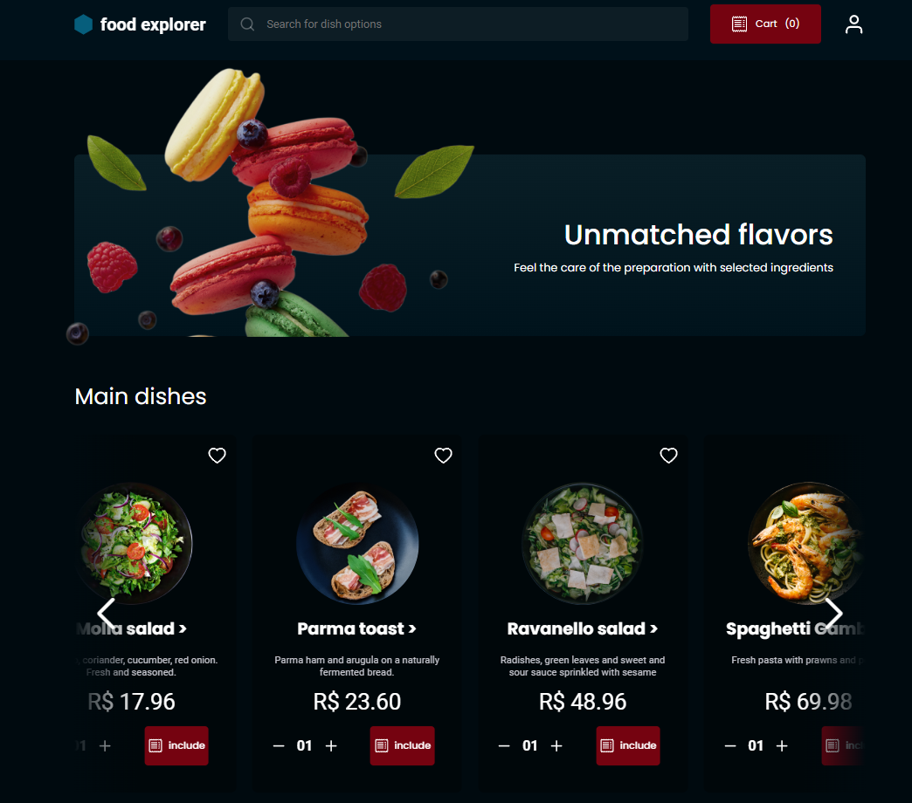

<h1 align="center"> Project - Food Explorer 🍽</h1>

<p align="center">
Time to put into practice what was taught during all the stages!!

<p align="center">
  <a href="#-Technologies">Technologies</a>&nbsp;&nbsp;&nbsp;|&nbsp;&nbsp;&nbsp;
  <a href="#-Project">Project</a>&nbsp;&nbsp;&nbsp;|&nbsp;&nbsp;&nbsp;
  <a href="#-Layout">Layout</a>&nbsp;&nbsp;&nbsp;|&nbsp;&nbsp;&nbsp;
  <a href="#memo-license">license</a>
</p>

<p align="center">
  
</p>

<br>

## 🚀 Technologies used in the project

It was produced with the following

&nbsp;
&nbsp;
&nbsp;


## 💻 Project
The Food Explorer is a restaurant web application. After registering, the user will be able to create orders and track their status. There is also a profile customization, favorite filtering, search field, and contact section with the restaurant. The cart is 100% functional and the user can choose between 2 payment methods (Credit Card or Pix)
The administrator can create/edit/remove dishes as they wish. They can also change the status of the orders, according to their preparation line in the kitchen. This status will be immediately updated on the consumers' screen.
## 🔖 Project Layout
Page from SignIn

<br>
<br>

<br>
 Rocket link: 
<br>
https://app.rocketseat.com.br/explorer/final-challenge

<br>
<br>
 Figma Link: 
<br>
https://www.figma.com/community/file/1196874589259687769

<br>
<br>
 Guide: 
<br>
https://efficient-sloth-d85.notion.site/Guia-de-resolu-o-Desafio-final-b38a81fe7cb5486e9e3fa600da5b3390

<br>
<br>

## Apprenticeship

- [ReactJs](https://reactjs.org)
- [Node.js](https://nodejs.org/en/)
- [Javascript](https://developer.mozilla.org/pt-BR/docs/Web/JavaScript)
- [Vite](https://vitejs.dev/)
- [Express](https://expressjs.com)
- [Nodemon](https://nodemon.io/)
- [SQLite](https://www.sqlite.org/index.html)
- [Knex](https://knexjs.org/)
- [BCryptjs](https://www.npmjs.com/package/bcryptjs)
- [JSON Web Token](https://www.npmjs.com/package/jsonwebtoken)
- [Axios](https://www.npmjs.com/package/axios)
- [Styled Components](https://styled-components.com/)
- [React Icons](https://react-icons.github.io/react-icons/)
- [React Router Dom](https://react-icons.github.io/react-icons/)

<br>
<br>

## :bulb: Utilização

- Local Test

- Start by cloning the project:

```bash
  $ https://github.com/MvriloNascimento/Food-Explorer-Back-End-.git
```

- Enter the directory:

```bash 
  $ cd + sua pasta + git clone https://github.com/MvriloNascimento/Food-Explorer-Back-End-.git
```

- Install dependencies:

```bash
  $ npm install
```

- Start a local server:

```bash
  $ npm run dev
```

- If everything goes well, you will receive a message similar to this:

```bash
 VITE v4.2.1  ready in 686 ms

  ➜  Local:   http://localhost:5173/
  ➜  Network: use --host to expose
  ➜  press h to show help
```

- Now open your browser at the address entered in "`Local`" to test the application.


## Test in Website
!!RECOMMENDED!!
- Want to see how the application works from the administrator's or user's perspective?
- Use the following accounts:
- As an administrator: email: admin@admin.com password: admin123
- As a user, you can access with these credentials or create your own: email: user@user.com password: user123


## Website
 - https://foodexplorer777.netlify.app
---
